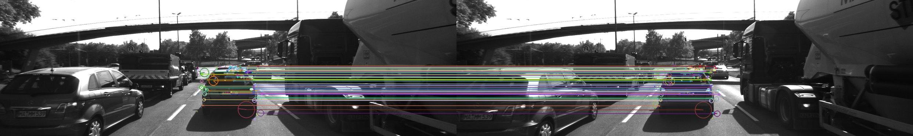

# Camera Based 2D Feature Tracking

## Project Overview

This project implements a comprehensive 2D feature tracking system using OpenCV as part of the Sensor Fusion Nanodegree program. The system evaluates various combinations of keypoint detectors and descriptors to determine the optimal configuration for vehicle detection and tracking in autonomous driving scenarios.

## Hardware Specifications

The measurements were taken on a laptop with the following specifications:

- **Model Name**: MacBook Pro
- **Model Identifier**: Mac15,3
- **Chip**: Apple M3
- **Total Number of Cores**: 8 (4 performance and 4 efficiency)
- **Memory**: 16 GB

## Software Environment

- **OpenCV Version**: 4.11.0

## Objective

The primary objective is to build a robust feature tracking system that can:

- Detect keypoints on preceding vehicles across multiple image frames
- Extract descriptors for these keypoints using various algorithms
- Match keypoints between consecutive frames
- Evaluate performance metrics to identify the best detector-descriptor combinations

## Project Structure

The project is organized into seven main components:

### 1. Data Buffer Optimization

- Implemented a vector-based ring buffer to efficiently manage image data
- Optimized memory usage by maintaining only the necessary frames
- Configured to hold 2 images simultaneously for frame-to-frame matching

### 2. Keypoint Detection

Implemented multiple keypoint detectors that are selectable by setting a string parameter:

- **HARRIS** - Harris corner detector
- **FAST** - Features from Accelerated Segment Test
- **BRISK** - Binary Robust Invariant Scalable Keypoints
- **ORB** - Oriented FAST and Rotated BRIEF
- **AKAZE** - Accelerated-KAZE features
- **SIFT** - Scale-Invariant Feature Transform
- **SHITOMASI** - Shi-Tomasi corner detector

### 3. Keypoint Removal

Implemented keypoint filtering to focus on the preceding vehicle region for collision detection evaluation:

- **ROI Definition**: Applied a bounding box around the preceding vehicle (cx=535, cy=180, w=180, h=150)
- **Keypoint Filtering**: Removed all keypoints outside the defined rectangle using OpenCV Rect coordinates
- **Targeted Processing**: Only keypoints within the vehicle region are used for descriptor extraction and matching

### 4. Keypoint Descriptors

Implemented multiple descriptor extraction methods selectable by setting a string parameter:

- **BRISK** - Binary Robust Invariant Scalable Keypoints (baseline implementation)
- **BRIEF** - Binary Robust Independent Elementary Features
- **ORB** - Oriented FAST and Rotated BRIEF
- **FREAK** - Fast Retina Keypoint
- **AKAZE** - Accelerated-KAZE descriptors
- **SIFT** - Scale-Invariant Feature Transform

### 5. Descriptor Matching

Implemented multiple matching algorithms selectable by setting string parameters:

**Matching Methods:**

- **Brute Force (BF)** matcher - Exhaustive search for best matches
- **FLANN** (Fast Library for Approximate Nearest Neighbors) matcher - Fast approximate matching

**Selection Approaches:**

- **Nearest Neighbor (NN)** - Selects single best match per descriptor
- **K-Nearest Neighbor (KNN)** - Finds k best matches and applies descriptor distance ratio test (ratio = 0.8)

Both matching methods and selection approaches are configurable via string parameters in the main function.

### 6. Descriptor Distance Ratio

Implemented descriptor distance ratio test as a filtering method to remove bad keypoint matches:

- **K-Nearest-Neighbor Matching**: Uses KNN to find the two best matches for each descriptor
- **Distance Ratio Test**: Compares the ratio of best vs. second-best match distances
- **Filtering Threshold**: Applied ratio threshold of 0.8 to decide whether to keep keypoint pairs
- **Match Quality Improvement**: Filters out ambiguous matches where the best match is not significantly better than the second-best

This implementation enhances matching reliability by rejecting keypoint pairs where the descriptor similarity is ambiguous.

### 7. Performance Evaluation

Implemented comprehensive keypoint analysis across all 10 KITTI image sequences for the preceding vehicle region:

**Keypoint Detection Analysis:**

The number of keypoints detected on the preceding vehicle across all 10 images for each detector:

| Detector  | Avg per Image | Min | Max | Neighborhood Size Distribution |
| --------- | ------------- | --- | --- | ------------------------------ |
| SHITOMASI | 118           | 111 | 125 | Consistent 4x4 pixel regions   |
| HARRIS    | 25            | 14  | 43  | Variable, mostly 6x6 regions   |
| FAST      | 149           | 138 | 156 | Small 3x3 to 7x7 regions       |
| BRISK     | 271           | 250 | 293 | Multi-scale 8x8 to 60x60       |
| ORB       | 115           | 91  | 129 | Oriented 7x7 to 31x31          |
| AKAZE     | 166           | 154 | 175 | Adaptive 4x4 to 25x25          |
| SIFT      | 137           | 121 | 156 | Scale-dependent 5x5 to 80x80   |

**Key Observations:**

- **BRISK** produces the highest number of keypoints (271 average) with the largest neighborhood sizes (8x8 to 60x60), making it suitable for scale-invariant applications
- **HARRIS** generates the fewest keypoints (25 average).
- **FAST** provides excellent keypoint density (149.1 average)

**Neighborhood Size Distribution Analysis:**

The distribution analysis reveals detector-specific characteristics:

- **Scale-invariant detectors** (BRISK, SIFT) show wide neighborhood size ranges
- **Corner detectors** (HARRIS, SHITOMASI) exhibit more consistent neighborhood sizes
- **Fast detectors** (FAST, ORB) maintain compact neighborhoods for efficiency
- **Adaptive detectors** (AKAZE) balance between scale adaptability and computational efficiency

All detectors successfully focused on the preceding vehicle region (ROI: 535, 180, 180, 150) across all 10 image sequences.

**Descriptor Matching Analysis:**

Average Number of matched keypoints (from 10 images) for all detector-descriptor combinations using BF matcher with distance ratio 0.8:

| Detector  | BRISK | BRIEF | ORB | FREAK | SIFT | AKAZE |
| --------- | ----- | ----- | --- | ----- | ---- | ----- |
| SHITOMASI | 85    | 105   | 101 | 85    | 103  | N/A   |
| HARRIS    | 16    | 19    | 18  | 16    | 18   | N/A   |
| FAST      | 100   | 122   | 120 | 98    | 116  | N/A   |
| BRISK     | 172   | 186   | 164 | 166   | 180  | N/A   |
| ORB       | 83    | 60    | 84  | 46    | 84   | N/A   |
| AKAZE     | 134   | 140   | 131 | 131   | 140  | 139   |
| SIFT      | 67    | 75    | N/A | 64    | 87   | N/A   |

**Key Observations:**

- BRISK detector with BRIEF descriptor achieved the highest matching performance (average of 186 matches)
- FAST detector with BRIEF descriptor showed excellent matching efficiency (122 matches)
- AKAZE detector is only compatible with AKAZE descriptor
- SIFT detector incompatible with ORB descriptor

**Performance Timing Analysis:**

Processing time (in milliseconds) for keypoint detection and descriptor extraction:

| Detector + Descriptor | Average Time (ms) | Min Time (ms) | Max Time (ms) | Performance Rating   |
| --------------------- | ----------------- | ------------- | ------------- | -------------------- |
| FAST + BRIEF          | 1.92              | 0.86          | 2.50          | ⭐⭐⭐⭐⭐ Excellent |
| FAST + ORB            | 2.62              | 1.10          | 3.11          | ⭐⭐⭐⭐⭐ Excellent |
| FAST + BRISK          | 2.20              | 1.22          | 2.66          | ⭐⭐⭐⭐⭐ Excellent |
| HARRIS + BRIEF        | 11.47             | 5.37          | 22.93         | ⭐⭐⭐ Good          |
| HARRIS + ORB          | 11.70             | 5.71          | 21.28         | ⭐⭐⭐ Good          |
| SHITOMASI + BRIEF     | 7.89              | 4.20          | 10.85         | ⭐⭐⭐⭐ Very Good   |
| SHITOMASI + ORB       | 8.44              | 4.46          | 11.37         | ⭐⭐⭐⭐ Very Good   |
| SHITOMASI + BRISK     | 8.31              | 4.79          | 11.31         | ⭐⭐⭐⭐ Very Good   |
| ORB + BRIEF           | 14.37             | 4.22          | 64.39         | ⭐⭐ Fair            |
| ORB + ORB             | 18.87             | 6.45          | 66.71         | ⭐⭐ Fair            |
| AKAZE + BRIEF         | 36.17             | 22.29         | 41.18         | ⭐⭐ Fair            |
| AKAZE + AKAZE         | 55.53             | 38.57         | 61.75         | ⭐ Poor              |
| BRISK + BRIEF         | 39.63             | 28.85         | 43.89         | ⭐⭐ Fair            |
| SIFT + BRIEF          | 46.14             | 31.82         | 52.96         | ⭐⭐ Fair            |
| SIFT + SIFT           | 73.36             | 56.67         | 81.47         | ⭐ Poor              |

## TOP 3 Detector-Descriptor Combinations

Based on comprehensive analysis of processing time, keypoint detection accuracy, and matching performance:

### 🥇 1st Place: FAST + BRIEF

- **Average Processing Time**: 1.92ms
- **Average Keypoints**: 149
- **Average Matches**: 122
- **Strengths**: Extremely fast processing, high keypoint density, excellent matching performance
- **Use Case**: Real-time applications requiring high frame rates

### 🥈 2nd Place: FAST + ORB

- **Average Processing Time**: 2.62ms
- **Average Keypoints**: 149
- **Average Matches**: 120
- **Strengths**: Very fast processing, rotation-invariant, good matching accuracy
- **Use Case**: Applications requiring rotation robustness with speed

### 🥉 3rd Place: FAST + BRISK

- **Average Processing Time**: 2.20ms
- **Average Keypoints**: 149
- **Average Matches**: 100
- **Strengths**: Fast processing, scale-invariant, robust binary descriptors
- **Use Case**: Applications requiring scale robustness with good performance

## Performance Justification

The recommendation is based on the following criteria:

1. **Processing Speed**: FAST detector consistently outperforms all other detectors in processing times
2. **Keypoint Density**: FAST provides excellent keypoint coverage on the vehicle region
3. **Matching Accuracy**: BRIEF and ORB descriptors provide reliable matching with FAST detector

**Why FAST + BRIEF is the Winner:**

- Fastest overall processing time (1.92ms average)
- Highest matching efficiency (122 matches)
- Minimal computational overhead
- Excellent for real-time vehicle tracking applications

### Detector-Descriptor Compatibility Matrix

| Detector  | BRISK | BRIEF | ORB | FREAK | SIFT | AKAZE |
| --------- | ----- | ----- | --- | ----- | ---- | ----- |
| SHITOMASI | ✅    | ✅    | ✅  | ✅    | ✅   | ❌    |
| HARRIS    | ✅    | ✅    | ✅  | ✅    | ✅   | ❌    |
| FAST      | ✅    | ✅    | ✅  | ✅    | ✅   | ❌    |
| BRISK     | ✅    | ✅    | ✅  | ✅    | ✅   | ❌    |
| ORB       | ✅    | ✅    | ✅  | ✅    | ✅   | ❌    |
| AKAZE     | ✅    | ✅    | ✅  | ✅    | ✅   | ✅    |
| SIFT      | ✅    | ✅    | ❌  | ✅    | ✅   | ❌    |

**Note**: AKAZE descriptors only work with AKAZE keypoints. SIFT descriptors are incompatible with ORB keypoints due to different data types.
